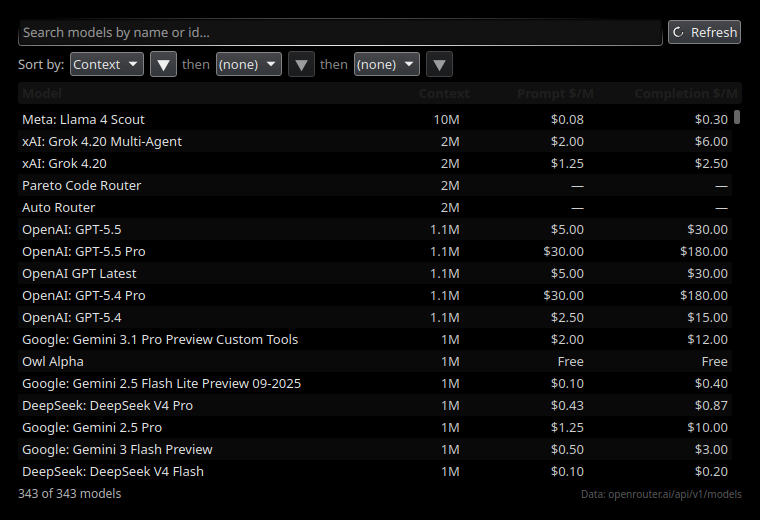

# OpenRouter Gauge

A KDE Plasma 5 panel widget that shows your [OpenRouter](https://openrouter.ai) prepaid credit balance at a glance.

The compact panel view shows the OpenRouter logo and your remaining balance, colour-coded by how much you have left (green → neutral → red). Click it for a popup with a full breakdown — total credits, total usage, and last-updated time — plus a manual refresh button.


> Figures shown are illustrative sample data.

## Features

- Live remaining balance in your panel, polled every 5 minutes
- Colour-coded status: healthy / low / critical / error
- Expandable popup with total credits, total usage, and last-updated timestamp
- Manual **Refresh** button
- API key stored via the widget's standard Configure dialog
- **Model browser** — search and sort every OpenRouter model by up to three dimensions at once

## Browse models

Click **Browse Models…** in the popup to open a searchable, sortable table of every model on OpenRouter.

Unlike the website, you can sort by **up to three dimensions at once** — for example, context length, *then* prompt price, *then* name — using the three sort tiers. Type in the search box to filter by name or id, and **click any row to copy its model id** (e.g. `anthropic/claude-opus-4.8`) to the clipboard.



## Requirements

- KDE Plasma **5.27** (built and tested against 5.27.x; uses the Plasma 5 / Qt 5 QML APIs)
- An OpenRouter API key (`sk-or-v1-…`) — a regular key, **not** a Management key

## Install

```bash
# Recommended: install as a proper Plasma package
kpackagetool5 -t Plasma/Applet -i ./package/

# To upgrade an existing install, use -u instead of -i:
# kpackagetool5 -t Plasma/Applet -u ./package/
```

Or use the bundled script (copies files into place):

```bash
./install.sh
```

Then add it to a panel: **right-click your panel → Add Widgets → search "OpenRouter"** and drag it in.

## Configure

Right-click the widget → **Configure** → paste your OpenRouter API key (`sk-or-v1-…`).
Get a key at [openrouter.ai/settings/keys](https://openrouter.ai/settings/keys).

## How it works

The widget calls `GET https://openrouter.ai/api/v1/credits` with your key as a Bearer token and computes:

```
remaining balance = data.total_credits − data.total_usage
```

The model browser uses the public `GET https://openrouter.ai/api/v1/models` endpoint (no API key required).

## Uninstall

```bash
kpackagetool5 -t Plasma/Applet -r com.stark.openrouter-gauge
```

## License

[MIT](./LICENSE) © Stark Botha
